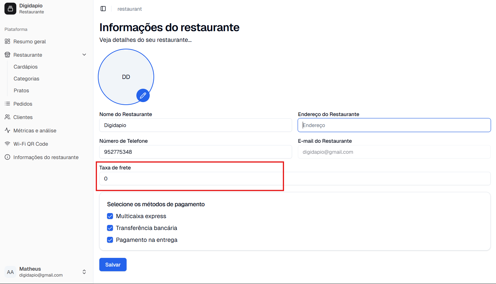
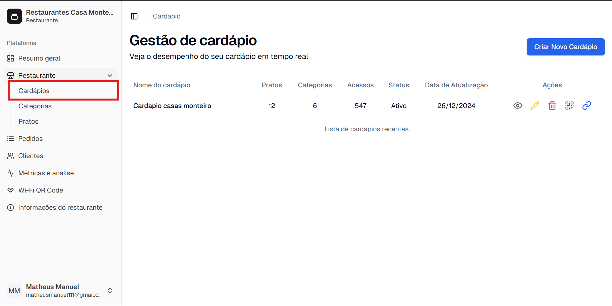
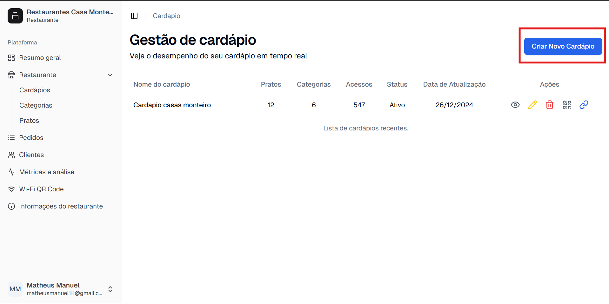
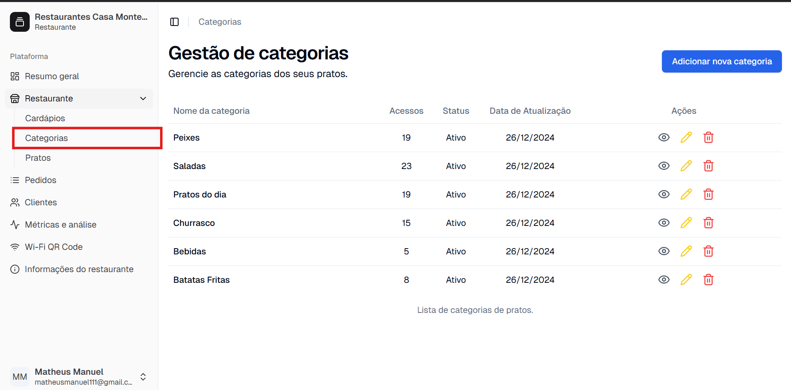
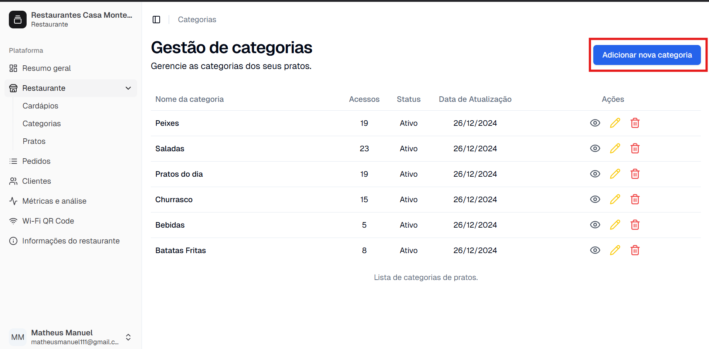
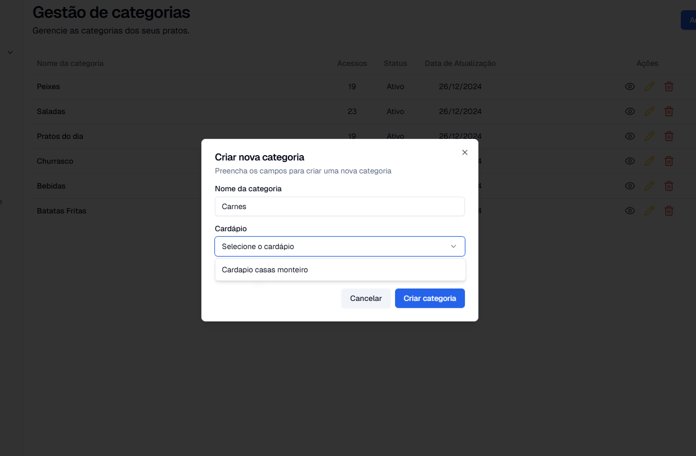
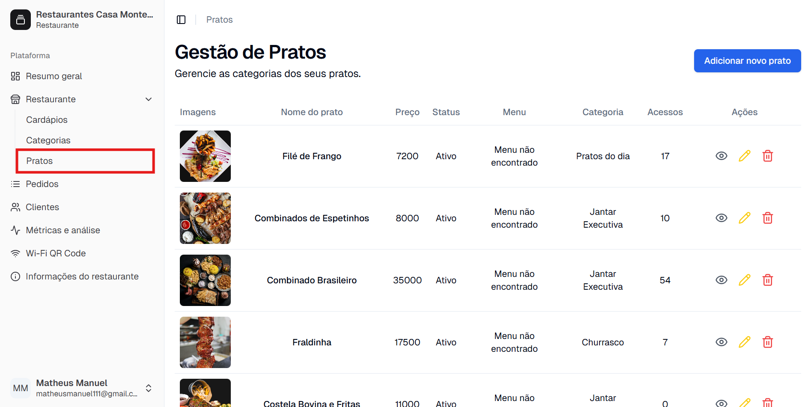
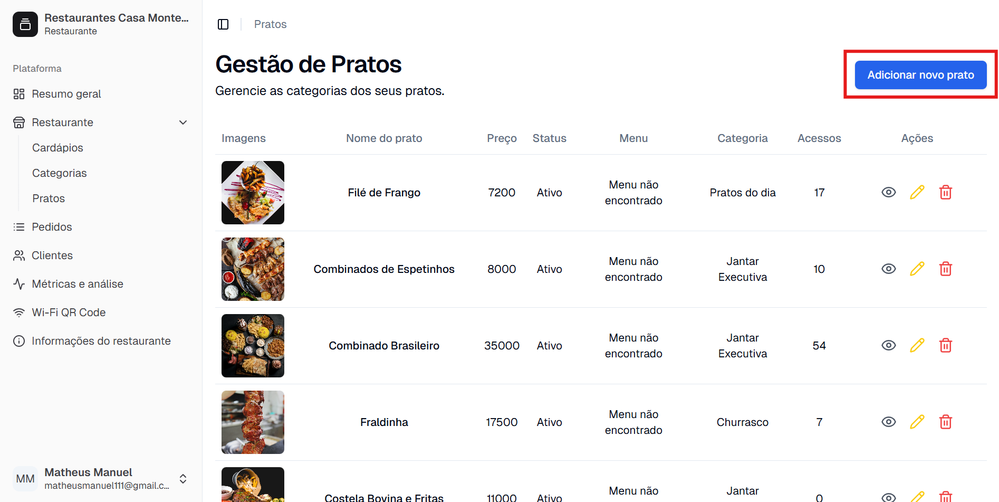
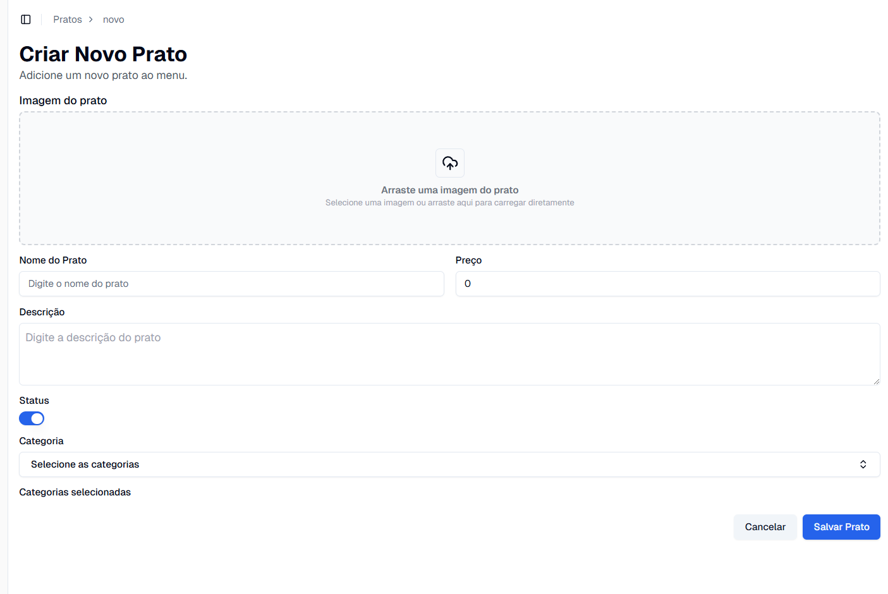
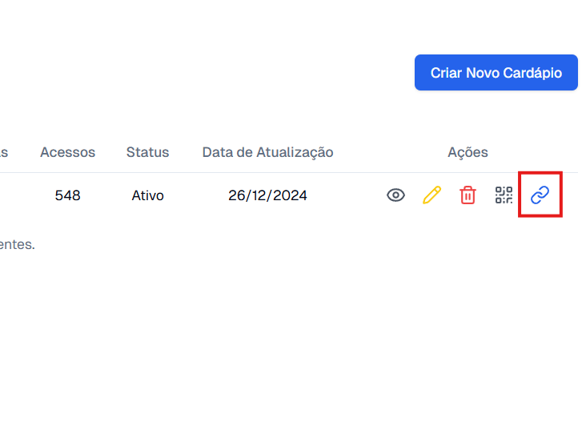

# **Tutorial: Como Usar a Plataforma DigiDapio**

Bem-vindo à DigiDapio! Este tutorial foi feito para ajudar você a configurar e utilizar a plataforma de forma rápida e simples. Vamos começar?

---

## **1. Usando a Licença no Momento do Cadastro**

- Ao se cadastrar na DigiDapio, você receberá uma licença digital conforme o plano escolhido.  
- Após o pagamento, a licença será enviada para o seu e-mail/WhatsApp e será necessária para ativar o acesso à plataforma.  
- **Passo 1:** Acesse a página de cadastro clicando nesse [link](https://www.digidapio.com/cadastrar).  
- **Passo 2:** Preencha as informações solicitadas e clique em continuar.  
- **Passo 3:** Insira o código da licença no campo indicado.  
- **Passo 4:** Complete seu cadastro e acesse a plataforma!  

---

## **2. Configuração Inicial**

Ao entrar na plataforma pela primeira vez, siga as etapas abaixo para configurar seu restaurante.  

- **Passo 1:** Faça login na plataforma usando suas credenciais.  
- **Passo 2:** Acesse as informações do seu restaurante clicando em "Informações do restaurante".  
    
- **Passo 3:** Adicione as informações do seu restaurante, como nome, endereço e logo.  
- **Passo 4:** Depois de concluído, clique em "Salvar".  

---

## **3. Criar um Cardápio Digital**

Agora que o restaurante está configurado, vamos criar o seu cardápio digital.  

- **Passo 1:** Vá para a seção de "Cardápios" no painel lateral.  
    
- **Passo 2:** Clique em “Adicionar Novo Cardápio”.  
    
- **Passo 3:** Insira o nome do cardápio (por exemplo, "Almoço", "Jantar").  
- **Passo 4:** Salve as alterações.  

---

## **4. Criar uma Categoria**

- **Passo 1:** Na seção de "Restaurante", clique em "Categorias".  
    
- **Passo 2:** Clique em “Adicionar nova categoria”.  
    
- **Passo 3:** Dê um nome à categoria (ex: "Entradas", "Pratos Principais").  
- **Passo 4:** Selecione os cardápios onde essa categoria será exibida.  
    
- **Passo 5:** Salve a categoria.  

---

## **5. Criar um Prato**

Agora, vamos adicionar os pratos ao seu cardápio.  

- **Passo 1:** Vá para a seção de "Pratos" no painel lateral.  
    
- **Passo 2:** Clique em “Adicionar novo Prato” na categoria desejada.  
    
- **Passo 3:** Insira o nome do prato, descrição e preço.  
- **Passo 4:** Adicione uma imagem do prato.  
- **Passo 5:** Defina as categorias do prato.  
    
- **Passo 6:** Salve o prato.  

---

## **6. Gestão dos Pedidos**

A DigiDapio facilita a gestão de pedidos no seu restaurante.  

- **Passo 1:** Acesse a seção "Pedidos" no painel de controle.  
- **Passo 2:** Você verá uma lista de pedidos, organizados por status.  
- **Passo 3:** Clique em um pedido para visualizar os detalhes.  
- **Passo 4:** Atualize o status conforme o andamento do pedido.  

---

## **7. Compartilhando seu Cardápio Digital**

A DigiDapio permite compartilhar seu cardápio digital facilmente.  

- **Passo 1:** Vá para a seção de "Cardápios" no painel lateral.  
- **Passo 2:** Você verá uma lista dos seus cardápios digitais.  
- **Passo 3:** Clique no ícone da corrente.  
    
- **Passo 4:** O link do menu digital será copiado para a sua área de transferência. Agora, é só enviá-lo para os seus clientes.  

---

## **8. Compartilhamento via QR Code Wi-Fi**

Além do link, você pode gerar um QR Code para compartilhar o Wi-Fi do restaurante.  

- **Passo 1:** Vá para a seção "QR Code Wi-Fi" no painel lateral.  
- **Passo 2:** Insira as informações da sua rede (SSID e senha).  
- **Passo 3:** O QR Code será gerado automaticamente.  
- **Passo 4:** Imprima e disponibilize o QR Code para que seus clientes possam se conectar ao Wi-Fi facilmente.  

--

## **Suporte e Contato**

Se precisar de mais ajuda, nossa equipe de suporte está sempre à disposição!  

📞 WhatsApp: [Clique aqui para falar conosco](https://api.whatsapp.com/send/?phone=955541123)  
📧 E-mail: [digidapio@gmail.com](mailto:digidapio@gmail.com)  
🌐 Site: [https://digidapio.com/](https://digidapio.com/)  